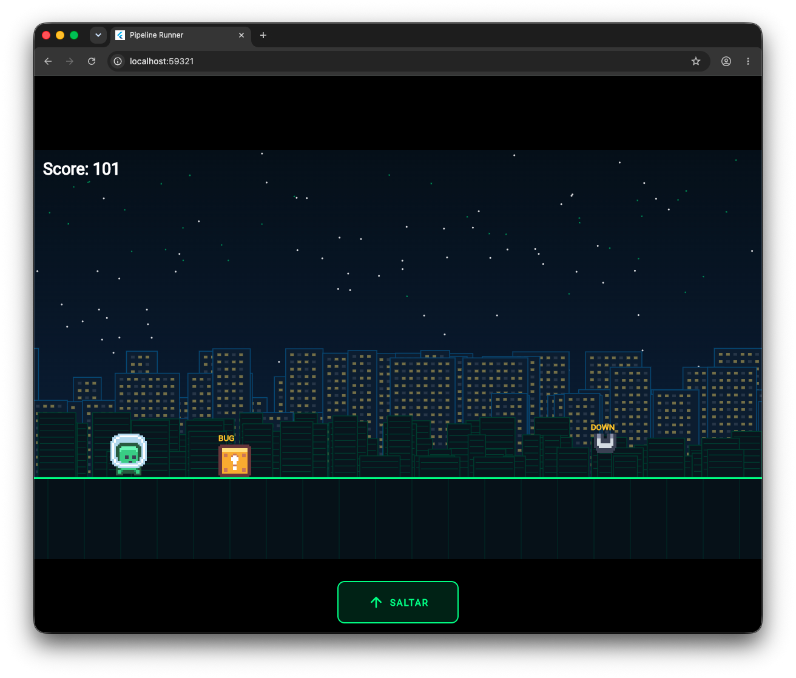
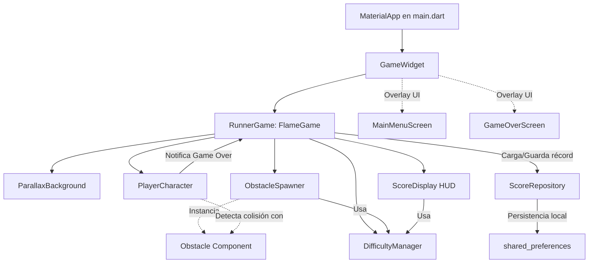

# 💻 Pipeline Runner

[](https://flutter.dev)
[](https://flame-engine.org)
[](https://opensource.org/licenses/MIT)



**Pipeline Runner** (también conocido internamente como *Commit Runner*) es un juego móvil de carrera infinita (infinite runner) desarrollado en **Flutter** utilizando el motor de videojuegos **Flame**. 

La temática del juego gira en torno al ciclo de desarrollo de software: el jugador controla a un **Commit** (representado por un avatar animado) que avanza de manera automática y debe esquivar obstáculos tecnológicos como **Bugs**, **Líneas de Código Rotas** y **Servidores Caídos** para intentar llegar a producción.

---

## 🎮 Mecánica del Juego

- **Movimiento Automático:** El personaje avanza constantemente hacia la derecha a una velocidad que se incrementa con el tiempo.
- **Controles Simples (Táctil / Clic):**
  - **Un toque:** Salto simple para esquivar obstáculos a nivel del suelo.
  - **Doble toque:** Salto doble para esquivar amenazas más grandes o corregir la trayectoria en el aire.
- **Obstáculos Procedurales:** El juego genera de forma infinita y aleatoria tres tipos de obstáculos:
  1. 🐛 **Bug (BUG):** Pequeño pero molesto.
  2. ⚡ **Línea rota (ERR):** Rápida y peligrosa.
  3. 🖥️ **Servidor caído (DOWN):** El obstáculo más alto y difícil de saltar.
- **Dificultad Incremental:** A medida que sobrevives, la velocidad general del juego aumenta y el intervalo de aparición de los obstáculos disminuye, aumentando el desafío.
- **Puntuación y Persistencia:** El puntaje incrementa según la distancia recorrida. El récord más alto (High Score) se guarda localmente de forma persistente.

---

## 🏗️ Arquitectura del Proyecto

El juego utiliza una arquitectura desacoplada donde el motor de Flame maneja la simulación física, las colisiones y el renderizado gráfico, mientras que Flutter gestiona la interfaz de usuario (menús y pantallas superpuestas) a través de overlays.

### Diagrama de Componentes



---

## 🛠️ Estructura del Código

El proyecto está organizado en las siguientes carpetas y archivos clave:

- [lib/main.dart](file:///Users/juan-campuzano/Documents/projects/open-source/pipeline_runner/lib/main.dart): Punto de entrada de la aplicación. Configura la orientación horizontal (`landscape`), oculta la barra del sistema e inicializa el `GameWidget` con sus pantallas superpuestas (overlays) y el botón físico de salto en letterbox.
- **Carpeta `lib/game/`:** Contiene toda la lógica del motor Flame.
  - [runner_game.dart](file:///Users/juan-campuzano/Documents/projects/open-source/pipeline_runner/lib/game/runner_game.dart): Controla el ciclo de vida del juego, inicializa componentes y maneja el reinicio de la partida.
  - [player.dart](file:///Users/juan-campuzano/Documents/projects/open-source/pipeline_runner/lib/game/player.dart): Representa al personaje del juego (`PlayerCharacter`), su gravedad, las animaciones de correr/saltar y la lógica de colisión.
  - [obstacle.dart](file:///Users/juan-campuzano/Documents/projects/open-source/pipeline_runner/lib/game/obstacle.dart): Define los tres tipos de obstáculos (`Bug`, `Broken Line`, `Server Down`), sus dimensiones y sus hitboxes.
  - [obstacle_spawner.dart](file:///Users/juan-campuzano/Documents/projects/open-source/pipeline_runner/lib/game/obstacle_spawner.dart): Generador procedural de obstáculos basado en intervalos de tiempo.
  - [difficulty_manager.dart](file:///Users/juan-campuzano/Documents/projects/open-source/pipeline_runner/lib/game/difficulty_manager.dart): Ajusta gradualmente la velocidad del mundo y la frecuencia de obstáculos a medida que avanza el tiempo.
  - [score_display.dart](file:///Users/juan-campuzano/Documents/projects/open-source/pipeline_runner/lib/game/score_display.dart): HUD en pantalla que muestra el puntaje actual en tiempo real.
  - [parallax_background.dart](file:///Users/juan-campuzano/Documents/projects/open-source/pipeline_runner/lib/game/parallax_background.dart): Dibuja un fondo animado de tres capas (estrellas/código, siluetas de servidores y una cuadrícula estilo retro digital en el suelo).
  - [score_repository.dart](file:///Users/juan-campuzano/Documents/projects/open-source/pipeline_runner/lib/game/score_repository.dart): Repositorio para cargar y guardar la puntuación más alta localmente via `shared_preferences`.
- **Carpeta `lib/screens/`:** Pantallas de Flutter para menús.
  - [main_menu.dart](file:///Users/juan-campuzano/Documents/projects/open-source/pipeline_runner/lib/screens/main_menu.dart): Pantalla de inicio con el título del juego y el botón de inicio ("💻 COMMIT RUNNER").
  - [game_over.dart](file:///Users/juan-campuzano/Documents/projects/open-source/pipeline_runner/lib/screens/game_over.dart): Pantalla de Game Over ("💥 MERGE CONFLICT") que muestra la puntuación, si es récord, y un botón para reintentar.

---

## 🚀 Instalación y Ejecución

### Requisitos Previos

Asegúrate de tener instalado el SDK de Flutter en tu sistema:
```bash
flutter --version
```

### Pasos para Ejecutar

1. **Obtener las dependencias del proyecto:**
   ```bash
   flutter pub get
   ```

2. **Ejecutar el proyecto en desarrollo:**
   - Para un dispositivo conectado, simulador o emulador:
     ```bash
     flutter run
     ```
   - Para ejecutar directamente en el navegador Web (ideal para deparar/probar):
     ```bash
     flutter run -d chrome
     ```

---

## 🧪 Pruebas Unitarias

Para correr el set de pruebas del juego, utiliza el siguiente comando:
```bash
flutter test
```

---

## 🎨 Recursos Utilizados

- **Gráficos/Sprites:** Sourced/Adaptados de [kenney.nl](https://kenney.nl) (Licencia CC0 - Dominio Público).
- **Temática:** Inspirada en la vida del desarrollador de software y DevOps.
